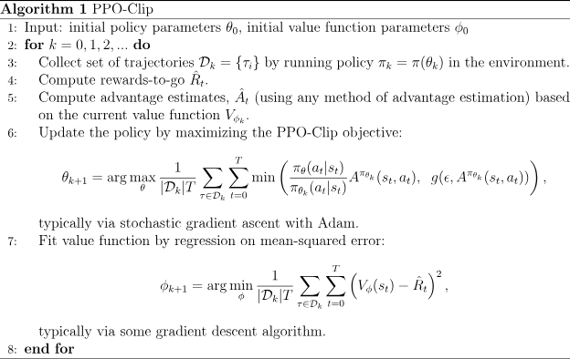

This implements the PPO[1] using Pytorch.
 
It is inspired directly by the below
https://spinningup.openai.com/en/latest/algorithms/ppo.html
https://github.com/implementation-matters/code-for-paper
https://pytorch.org/tutorials/intermediate/reinforcement_ppo.html
https://medium.com/analytics-vidhya/coding-ppo-from-scratch-with-pytorch-part-1-4-613dfc1b14c8
https://www.kaggle.com/code/arunmohan003/proximal-policy-optimization-using-pytorch

[1] Schulman, J., Wolski, F., Dhariwal, P., Radford, A., & Klimov, O. (2017). Proximal policy optimization algorithms. arXiv preprint arXiv:1707.06347.